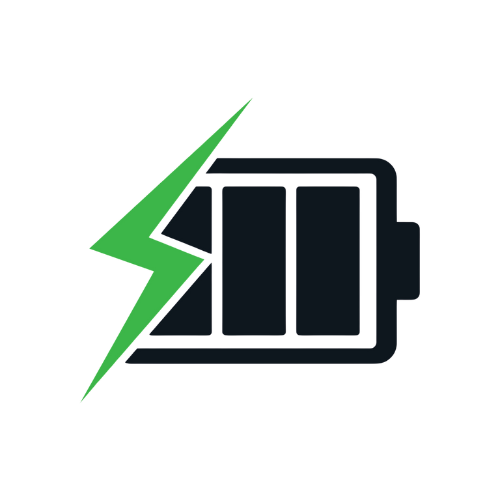

<div align="center">

# ⚡ Smart Charger ⚡



_A desktop application that intelligently manages device charging to extend battery lifespan_

[](https://www.python.org/)
[](https://www.espressif.com/)
[](LICENSE)
[](https://www.buymeacoffee.com/jaigurul20z)

</div>

## 🔍 Project Overview

Smart Charger monitors your laptop's battery percentage and controls a connected ESP8266-based charging device to automatically:

- ✅ Turn off charging when battery reaches above 90%
- ✅ Turn on charging when battery falls below 20%

This helps extend battery lifespan by preventing overcharging and excessive discharge cycles.

## ✨ Features

- 🔌 Automatic charging control based on battery levels
- 🔍 Dynamic ESP8266 device detection (CH340 chip)
- 🔄 Real-time battery monitoring
- 🖥️ System tray integration for non-intrusive operation
- 📊 Detailed activity logging

## 🛠️ Hardware Requirements

- ESP8266-based smart charger device
- USB connection to computer (CH340 chip)
- Relay module to control charging circuit
- Power supply components (as shown in circuit diagram)

## 📦 Software Requirements

- Python 3.x
- Required Python packages (see `requirements.txt`):
  - psutil
  - pyserial
  - pystray
  - pillow
  - pyinstaller (for creating executable)

## 🚀 Installation

1. Clone or download this repository
2. Install required packages:
   ```bash
   pip install -r requirements.txt
   ```
3. Upload the `esp_code.c` to your ESP8266 using the Arduino IDE
4. Connect your ESP8266 smart charger device to your computer via USB

## 📱 Usage

### Running from Source

```bash
python main.py
```

### Running as Executable

After building with PyInstaller, run the generated executable file from the `build/main` directory.

## 🔄 How It Works

1. The application runs in the system tray 🖥️
2. It continuously monitors battery level and charging status 🔋
3. When battery level exceeds 90% while charging, it sends `off` command to the ESP8266 ⬇️
4. When battery level drops below 20% while not charging, it sends `on` command to the ESP8266 ⬆️
5. The ESP8266 controls the physical charging circuit ⚡

## 📡 ESP8266 Communication

- Serial communication at 9600 baud rate
- Commands:
  - `on` - Enable charging
  - `off` - Disable charging
- Device automatically detected using CH340 chip identifier

### ESP8266 Code

The ESP8266 runs the following code to control the charging circuit:

```c
#define LED_PIN 2  // Controls the relay for charging

void setup() {
  pinMode(LED_PIN, OUTPUT);
  Serial.begin(9600);
  Serial.println("ESP Ready. Type 'on' or 'off'.");
}

void loop() {
  if (Serial.available()) {
    String cmd = Serial.readStringUntil('\n');
    cmd.trim();

    if (cmd == "on") {
      digitalWrite(LED_PIN, HIGH);  // Turn on charging
      Serial.println("LED turned ON");
    } else if (cmd == "off") {
      digitalWrite(LED_PIN, LOW);   // Turn off charging
      Serial.println("LED turned OFF");
    } else {
      Serial.println("Unknown command");
    }
  }
}
```

**Note:** The `LED_PIN` (GPIO2) controls a relay module that switches the charging circuit on or off.

## 📝 Circuit Diagram

The hardware implementation uses the following circuit design:

<div align="center">


</div>

## 🔨 Build Instructions

To create a standalone executable:

```bash
pyinstaller --onefile --windowed --icon=smart_charger.ico main.py
```

## 📋 Logs

Activity logs are stored in `app.log` in the application directory.

## ⚖️ License

This project is licensed under the MIT License - see the LICENSE file for details.

## 🤝 Contributing

Contributions are welcome! Please feel free to submit a Pull Request.

---

<div align="center">

**Made with ❤️ by Smart Charger Team**

<a href="https://www.buymeacoffee.com/jaigurul20z"></a>

</div>
